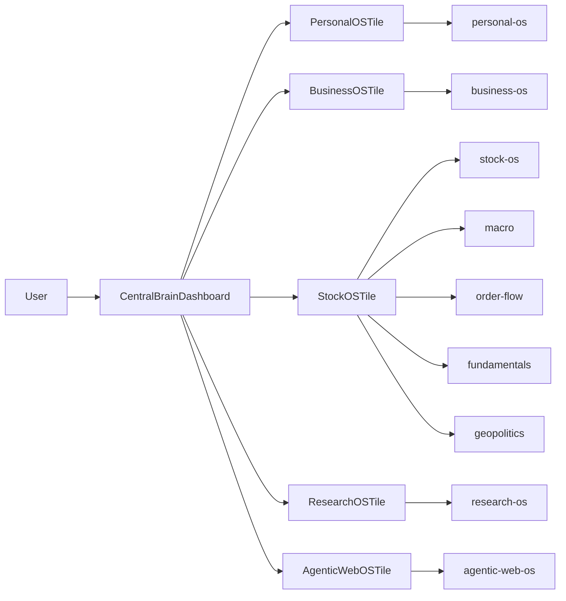

# THIRAMAI Central Brain OS Architecture

## 1) System intent

THIRAMAI centralizes five operating-system modules into one control plane:

1. Personal OS
2. Business OS
3. Stock OS
4. Research OS
5. Agentic Web OS

This design follows:

- **TOGAF layered architecture** (business, application, data, technology)
- **ISO 25010** non-functionals (reliability, usability, performance efficiency)
- **OpenAPI 3.0 modular contract boundaries**

## 2) Layered architecture

## 3) Component tree (MVP)

- `DashboardPage` (Central Brain shell)
- `useCentralBrainState` (aggregation + normalization + polling)
- `OSModuleTile` (shared module visualization)
- `FourPointEngineStrip` (Stock OS realtime engine)
- Existing supporting panels:
  - `AIAssistantPanel`
  - `AuditPanel`

## 4) State management strategy

`useCentralBrainState(explicitOrgId)` is the orchestration hook for dashboard module state:

- Executes module fetches in parallel.
- Normalizes each module to a stable view model:
  - `id`
  - `title`
  - `route`
  - `liveStatus`
  - `statusDetail`
  - `quickMetrics[]`
  - `agentActivity`
  - `fourPointEngine` (Stock OS only)
- Uses bounded polling (12s), timeout protection (9s), and stale-request guards.
- Separates `loading` and `refreshing` semantics for UX reliability.

This keeps hook order deterministic and avoids render-path dependent hook execution.

## 5) OpenAPI 3.0 contract boundaries per OS

### personal-os
- `GET /personal/os/today-brief`
- `GET /personal/os/weekly-review`
- `GET|POST /personal/os/expenses`
- `GET|POST /personal/os/vitals`
- `GET /personal/os/meetings/today`

### business-os
- `GET /business/snapshot`
- `GET /business/pl-daily`
- `GET|POST /business/tasks`
- `GET|POST|PATCH /business/subsidy`
- `GET|POST /business/expenses/list|/business/expenses`

### stock-os
- `GET|POST /stocks/assistant/watchlist`
- `GET /stocks/assistant/quote/{symbol}`
- `GET /stocks/assistant/signal/{symbol}`
- `GET /stocks/assistant/realtime/status`
- `WS /ws/stocks/{userId}`
- Realtime intelligence dimensions surfaced by dashboard:
  - macro
  - order-flow
  - fundamentals
  - geopolitics

### research-os
- `POST /research/engine/market`
- `POST /research/engine/deep`
- `POST /research/engine/schemes`
- `POST /research/engine/competitors`
- `POST /research/engine/dpr`
- `GET /research/dpr`

### agentic-web-os
- `POST /website-builder/build`
- `POST /website-builder/deploy`
- `GET /website-builder/preview/{organizationId}`
- `GET /website-builder/meta/{organizationId}`
- UI namespace: `/os/agentic-platform`

## 6) Hybrid migration rollout

### Phase 0: Compatibility bridge (implemented)
- Canonical command center routes:
  - `/os/personal`
  - `/os/business`
  - `/os/stock`
  - `/os/research`
  - `/os/agentic-platform`
- Legacy aliases:
  - `/dashboard/stocks` -> `/os/stock`
  - `/dashboard/research` -> `/os/research`
  - `/dashboard/website-builder` -> `/os/agentic-platform`
- Legacy client bridge:
  - `/today` and `/os/*` redirect to `/static/command_center/#/...`

### Phase 1: Central Brain adoption (implemented)
- Replace KPI-first dashboard with 5-module central brain model.

### Phase 2: Telemetry validation
- Track legacy redirect usage via `postUsageEvent("legacy_route_redirect", ...)`.
- Monitor:
  - legacy-path hit rate
  - module open rate by `/os/*`
  - degraded-module durations

### Phase 3: Decommission criteria
Decommission legacy route surfaces when all are true for two consecutive release windows:

- Legacy redirects < 2% of authenticated sessions.
- No increase in route-related 4xx/5xx in API edge logs.
- Business dashboard loading timeout incidents remain zero.
- User journey completion parity (Today, Business, Stock, Research, Platform flows).

## 7) ISO 25010 acceptance checks

- **Reliability**: every module can degrade independently; stale requests do not overwrite fresh state.
- **Usability**: each tile exposes health, metrics, and a single action path.
- **Performance efficiency**: bounded polling and parallel fetch orchestration with timeout limits.
